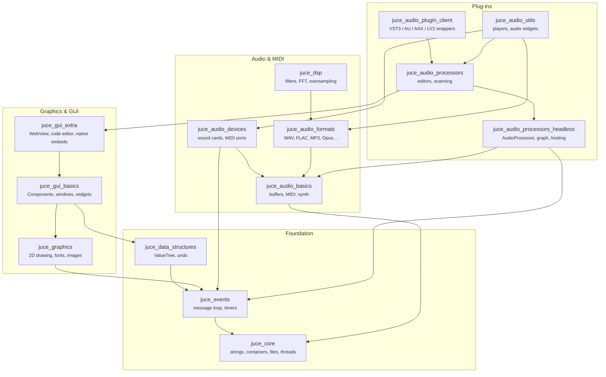
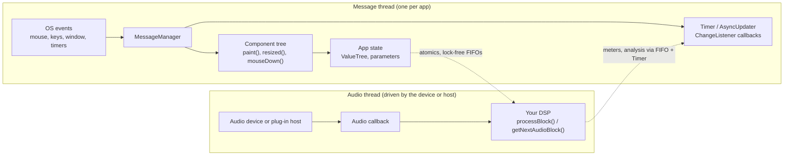
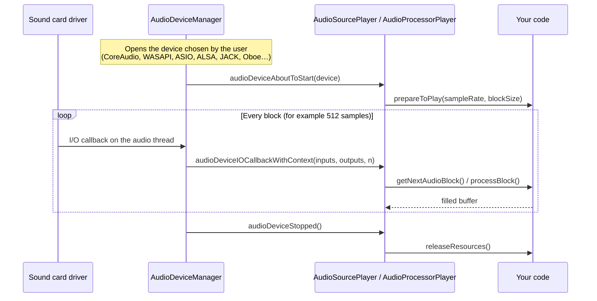
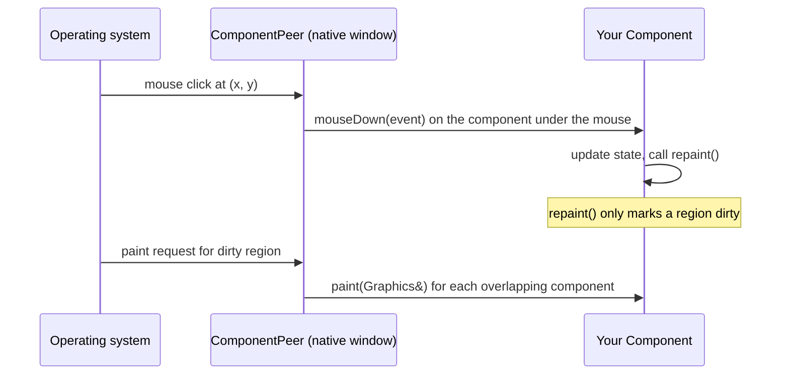
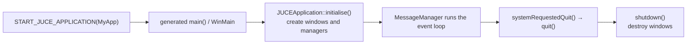
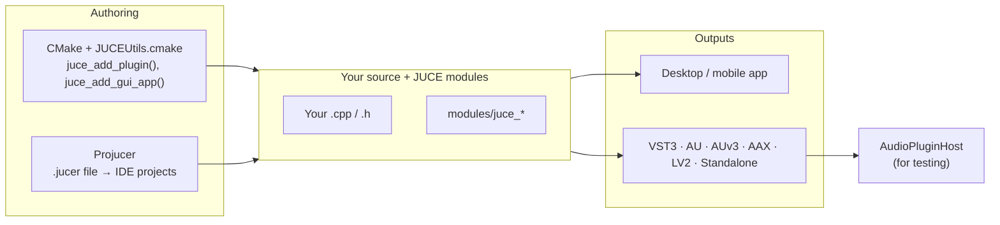

# Architecture

**JUCE is a stack of layered modules with two runtimes on top: an event-driven GUI on the *message thread*, and a real-time audio pipeline on the *audio thread*.** Most of what you write plugs into one of these two and passes data safely to the other.

## The layer cake

Each module declares its dependencies in its main header, so the framework forms a strict hierarchy with no cycles. Simplified, it looks like this (the [interactive module map](../reference/module-map) has every module and edge):

Arrows point from a module to what it depends on. Some things to notice:

- **`juce_core` depends on nothing.** It is JUCE's replacement for much of the C++ standard library, plus OS services.
- **`juce_events` is the hinge.** Anything asynchronous (GUI, timers, device change notifications, OSC) needs its message loop.
- **The audio stack does not need the GUI.** `juce_audio_basics`, `juce_audio_devices`, `juce_audio_formats`, and `juce_dsp` never touch `juce_graphics`. You can build a headless audio tool or server.
- **Plug-in code is split in two.** `juce_audio_processors_headless` holds the `AudioProcessor` interface, parameters, graph, and format hosting with no GUI dependency. `juce_audio_processors` adds editors and plug-in scanning UI on top. (The split arrived in JUCE 8.0.11, so older tutorials only mention `juce_audio_processors`.)
- **`juce_audio_utils` sits at the top** because it glues everything together: device selectors, waveform thumbnails, keyboard widgets, and players.

## The two runtimes

| | Message thread | Audio thread |
| --- | --- | --- |
| **Who drives it** | `MessageManager` running the OS event loop | The audio driver or plug-in host, every few milliseconds |
| **What runs there** | GUI, timers, file dialogs, most listeners | `processBlock()`, `getNextAudioBlock()`, `audioDeviceIOCallbackWithContext()` |
| **Rules** | May block briefly; must not freeze | No locks that can wait, no allocation, no file or network I/O, no GUI calls |
| **Talking to the other side** | Write atomics or push to a FIFO | Read atomics or pop from a FIFO; never call into Components |

Getting this boundary right is the most important skill in JUCE programming. See [Core concepts → Threads](./core-concepts#threads) for the tools JUCE gives you.

## How audio reaches your code

There are three common entry points. They share the same idea: something outside your code owns the clock and calls you with a buffer to fill.

### 1. A standalone audio app

`AudioAppComponent` (in `juce_audio_utils`) packages this for you. It is a `Component` *and* an `AudioSource`, with its own `AudioDeviceManager` and `AudioSourcePlayer`.

### 2. A plug-in

The host owns the clock. A format wrapper in `juce_audio_plugin_client` translates the host's calls (VST3's `process()`, AU's render callback, and so on) into `AudioProcessor::processBlock()`. See [Anatomy of a plug-in](./plugin-anatomy).

### 3. A plug-in host or modular app

`AudioProcessorGraph` connects many `AudioProcessor`s (your own or loaded third-party plug-ins) into one. An `AudioProcessorPlayer` then feeds it from an audio device. This is how `extras/AudioPluginHost` works.

## How the GUI reaches your code

- A **top-level** `Component` (usually a `DocumentWindow`) gets a `ComponentPeer`, the platform-specific native window.
- **Child** components are lightweight: they have no native window. JUCE hit-tests and clips them itself, so the same UI renders identically everywhere.
- Drawing goes through `Graphics`, which targets a rendering backend: CoreGraphics, Direct2D, the software renderer, or OpenGL.

## How an app starts

For a plug-in there is no `main()`: the host loads your binary and the wrapper calls `createPluginFilter()`, a function you provide that returns your `AudioProcessor`.

## Where the tools fit

See [Build systems](./build-systems) for details.
