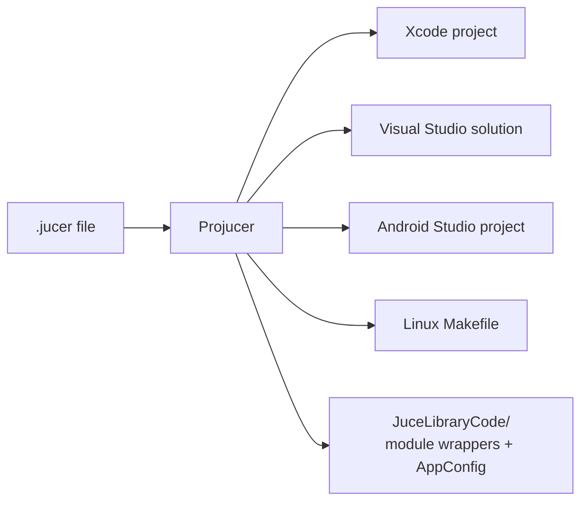

# Build systems

**JUCE ships as source. You compile the modules you need into your project, using either CMake (the modern default) or the Projucer (JUCE's original project generator).**

## How a module is compiled

A JUCE module is a folder with one main header and a small number of `.cpp` files that `#include` everything else. This is a "unity build" per module. It keeps compile times reasonable and means a module needs no include-path setup.

```
juce_audio_basics/
├── juce_audio_basics.h      ← main header: declaration block + #includes of public headers
├── juce_audio_basics.cpp    ← compile unit: #includes the implementation files
├── juce_audio_basics.mm     ← same, compiled instead of the .cpp on Apple platforms
├── buffers/                 ← implementation, grouped by topic
├── midi/
└── ...
```

The comment block at the top of the main header is machine-readable. This site's [module map](../reference/module-map) is generated from it:

```
BEGIN_JUCE_MODULE_DECLARATION
  ID:                 juce_audio_devices
  dependencies:       juce_audio_basics, juce_events
  OSXFrameworks:      CoreAudio CoreMIDI AudioToolbox
  linuxPackages:      alsa
END_JUCE_MODULE_DECLARATION
```

Platform-specific files use suffixes (`_mac`, `_windows`, `_linux`, `_android`, `_ios`). The full rules are in [`docs/JUCE Module Format.md`](https://github.com/andrewh/JUCE/blob/master/docs/JUCE%20Module%20Format.md). You can write your own modules in the same format.

## CMake (recommended)

JUCE 6 added a first-class CMake API. The helpers live in `extras/Build/CMake/`.

```cmake
cmake_minimum_required(VERSION 3.22)
project(MyPlugin VERSION 0.1.0)

add_subdirectory(JUCE)                    # or find_package(JUCE CONFIG REQUIRED)

juce_add_plugin(MyPlugin
    COMPANY_NAME "Me"
    PLUGIN_MANUFACTURER_CODE Mfgr
    PLUGIN_CODE Mplg
    FORMATS VST3 AU Standalone
    PRODUCT_NAME "My Plugin")

target_sources(MyPlugin PRIVATE PluginProcessor.cpp PluginEditor.cpp)

target_link_libraries(MyPlugin
    PRIVATE juce::juce_audio_utils juce::juce_dsp
    PUBLIC  juce::juce_recommended_config_flags
            juce::juce_recommended_lto_flags
            juce::juce_recommended_warning_flags)
```

| Function | Makes |
| --- | --- |
| `juce_add_gui_app` | a desktop or mobile GUI application |
| `juce_add_console_app` | a command-line tool |
| `juce_add_plugin` | a shared-code target plus one target per format (`MyPlugin_VST3`, `MyPlugin_AU`, …) |
| `juce_add_binary_data` | a static library embedding files (images, samples) as C++ arrays |
| `juce_add_module` / `juce_add_modules` | a target for your own or third-party JUCE-format modules |
| `juce_generate_juce_header` | the legacy `JuceHeader.h` convenience include |

Linking `juce::juce_<module>` pulls in that module *and its dependencies*, which is why the module graph matters.

Starting points: `examples/CMake/GuiApp`, `examples/CMake/ConsoleApp`, and `examples/CMake/AudioPlugin`. The full reference is [`docs/CMake API.md`](https://github.com/andrewh/JUCE/blob/master/docs/CMake%20API.md).

## The Projucer

The Projucer (in `extras/Projucer`) is a GUI app that edits a `.jucer` XML file describing your project, modules, and per-platform settings. It then **exports** native IDE projects: Xcode, Visual Studio, Android Studio, and Linux Makefiles. It also includes a code editor and a template wizard.



**When to use which?**

- **CMake**: CI-friendly, composes with other C++ libraries, and it's what most new projects and tutorials use.
- **Projucer**: quickest to try JUCE if you are comfortable in an IDE, and still needed by some older codebases. Its exporters are especially convenient for Android and iOS.

## PIPs

A **PIP** (*Projucer Instant Project*) is a single header file with a metadata block at the top. The Projucer (or `juce_add_pip` in CMake) turns it into a full project. Most of the demos in `examples/` are PIPs. Read the metadata block of any file in `examples/Audio` to see the format.

## Useful configuration flags

Modules expose options as preprocessor macros (`JUCE_*`), documented in each module's main header under "Config:" comments. Some you will meet early:

| Flag | Effect |
| --- | --- |
| `JUCE_WEB_BROWSER` | Enable `WebBrowserComponent` (on by default; the CMake examples turn it off and ask for `NEEDS_WEB_BROWSER TRUE` if you need it) |
| `JUCE_USE_CURL` | Use libcurl for networking on Linux |
| `JUCE_ASIO` | Enable ASIO audio device support on Windows |
| `JUCE_VST3_CAN_REPLACE_VST2` | Let a VST3 build replace an earlier VST2 in hosts |

In CMake, set them with `target_compile_definitions(MyTarget PUBLIC JUCE_WEB_BROWSER=0)`.
