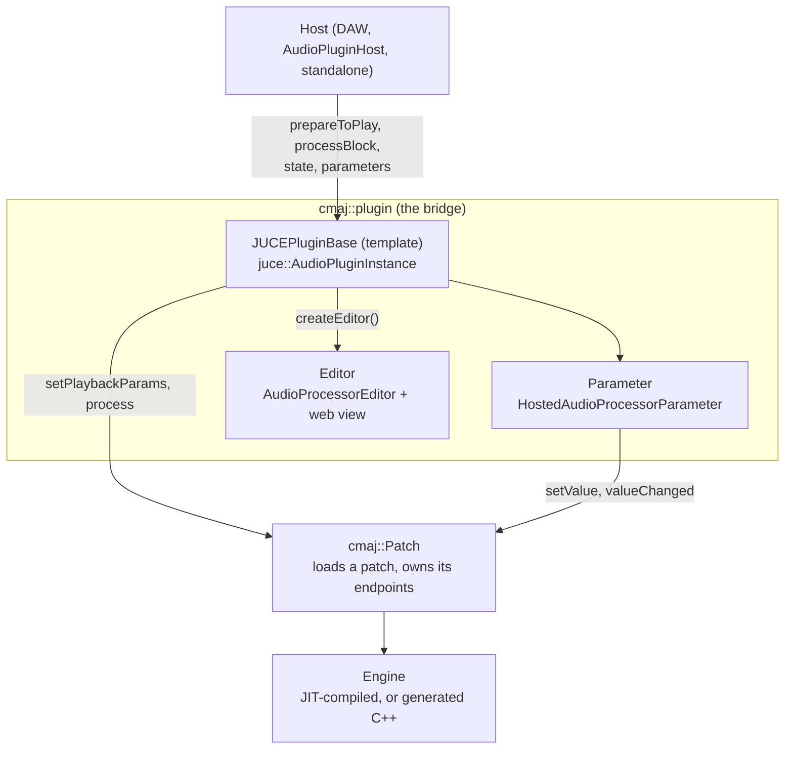

# Cmajor and the JUCE bridge

**Cmajor ships a JUCE bridge, `cmaj_JUCEPlugin.h`, that turns a Cmajor patch into a `juce::AudioPluginInstance`. It is about 1,350 lines of ordinary JUCE code, so it is a compact, real example of everything on the [plug-in anatomy](./plugin-anatomy) page: buses, `prepareToPlay()`, `processBlock()`, parameters, state, and an editor.**

[Cmajor](https://cmajor.dev) is a language for audio DSP. The bridge is useful here for a reason that has nothing to do with Cmajor syntax. It shows how a *foreign* DSP engine gets presented to a host through JUCE's contracts, and every decision it makes is a decision you make in your own `AudioProcessor`.

::: tip How to read this page
Each section names one JUCE concept, shows the bridge's version in an abridged excerpt, and points at the exact function so you can read the rest. The excerpts come from the [Cmajor repository](https://github.com/cmajor-lang/cmajor), which is GPLv3 or commercially licensed (see [Licence](#licence)).[^src]
:::

## The shape of it



The JUCE side is thin on purpose. `JUCEPluginBase` adapts; `cmaj::Patch` does the work of loading a patch, compiling it, and exposing its input and output *endpoints*. The base class is a template over its derived type (the curiously recurring template pattern), so a few compile-time flags select behaviour with `if constexpr` and cost nothing at run time.

| Class | Patch | Engine | Parameters the host sees |
| --- | --- | --- | --- |
| `JITLoaderPlugin` | any `.cmajorpatch`, dragged onto its editor | JIT compiled when loaded | a flat list of 100 pre-created slots |
| `SinglePatchJITPlugin` | one patch, fixed at construction | JIT compiled, reloads when the files change | built from the patch, with groups |
| `GeneratedPlugin<T>` | one patch, compiled ahead of time to C++ | generated C++, no compiler needed at run time | built from the patch, with groups |

There is also `JUCEPluginFormat`, which goes the other way: it is a `juce::AudioPluginFormat` so that a *host* built with JUCE can scan for `.cmajorpatch` files and instantiate them like any other plug-in.[^format]

## The constructor wires the patch to JUCE

The patch reports events through plain `std::function` callbacks. The constructor points each at the right JUCE mechanism:

```cpp
patch->stopPlayback  = [this] { suspendProcessing (true); };
patch->startPlayback = [this] { suspendProcessing (false); };

patch->patchChanged = [this]
{
    // run on the message thread, whichever thread the patch called us from
    if (juce::MessageManager::getInstance()->isThisTheMessageThread())
        handlePatchChange();
    else
        juce::MessageManager::callAsync ([this] { handlePatchChange(); });
};
```

*(Abridged from the `JUCEPluginBase` constructor.)*

Two lessons carry over to your own plug-ins. First, `suspendProcessing()` is the standard way to say "do not call `processBlock()` now" while something is being rebuilt. Second, anything that touches the host-facing object model (parameters, latency, the editor) is pushed to the message thread with `MessageManager::callAsync`, because the callback can arrive from a compile thread. The base class also derives from `juce::MessageListener` and posts a message to load new state, for the same reason.

## Buses come from the patch

A host asks about channel layouts before it plays anything, so the bridge has to know the patch's inputs and outputs *at construction time*. `getBusesProperties()` sums the audio channels over the patch's endpoints and declares at most one input bus and one output bus:

```cpp
if (inputChannelCount > 0)
    layout.addBus (true,  "in",  juce::AudioChannelSet::canonicalChannelSet ((int) inputChannelCount), true);

if (outputChannelCount > 0)
    layout.addBus (false, "out", juce::AudioChannelSet::canonicalChannelSet ((int) outputChannelCount), true);
```

`isBusesLayoutSupported()` then accepts a layout only when its channel counts match the patch's. This is why `SinglePatchJITPlugin` calls `preload()` on the patch inside a static function that feeds the base-class constructor: the bus layout must exist before the `AudioPluginInstance` is built. If you wrap an engine whose channel count is not known until later, you hit the same ordering problem.

## `prepareToPlay()` and `processBlock()`

`prepareToPlay()` passes the sample rate, block size, and the *current* channel counts to the patch, which is what lets a JIT engine specialise itself:

```cpp
void prepareToPlay (double sampleRate, int samplesPerBlock) override
{
    applyRateAndBlockSize (sampleRate, static_cast<uint32_t> (samplesPerBlock));
}

// ... which ends in (abridged):
patch->setPlaybackParams (Patch::PlaybackParams (rate, requestedBlockSize,
                                                 layout.getMainInputChannels(),
                                                 layout.getMainOutputChannels()));
```

`processBlock()` is the whole real-time story:

```cpp
void processBlock (juce::AudioBuffer<float>& audio, juce::MidiBuffer& midi) override
{
    if (! patch->isPlayable() || isSuspended())
    {
        audio.clear();
        midi.clear();
        return;
    }

    juce::ScopedNoDenormals noDenormals;

    if (auto ph = getPlayHead())
        updateTimelineFromPlayhead (*ph);

    for (auto m : midi)
        patch->addMIDIMessage (m.samplePosition, m.data, static_cast<uint32_t> (m.numBytes));

    midi.clear();

    patch->process (audio.getArrayOfWritePointers(),
                    static_cast<choc::buffer::FrameCount> (audio.getNumSamples()),
                    [&] (uint32_t frame, choc::midi::ShortMessage m)
                    {
                        midi.addEvent (m.data(), static_cast<int> (m.length()), static_cast<int> (frame));
                    });
}
```

*(Abridged: some casts removed.)*

Read it as a checklist for your own `processBlock()`:

1. **Silence when you cannot play.** Clear *both* buffers and return, so a half-built patch never leaks stale audio or MIDI.
2. **`ScopedNoDenormals`** keeps denormal floats from stalling the CPU.
3. **Timeline from the `AudioPlayHead`.** Tempo, position, and time signature come from the host and are forwarded to the patch.
4. **MIDI in, then clear, then MIDI out.** The input is copied into the patch and the buffer is emptied, so only what the patch emits goes back to the host.
5. **The audio buffer is processed in place.** There is no copy.

The `double` overload simply asserts, because the bridge only supports `float` processing.

## Parameters: the 0 to 1 contract

Hosts see every parameter as a number between 0 and 1. The patch has its own range and unit. The bridge's `Parameter` class is a `juce::HostedAudioProcessorParameter` that converts between the two on every call:

```cpp
float getValue() const override       { return patchParam->properties.convertTo0to1 (patchParam->currentValue); }
void setValue (float newValue) override { patchParam->setValue (patchParam->properties.convertFrom0to1 (newValue), false, -1, 0); }

// in PatchParameterProperties:
float convertTo0to1   (float v) const  { return std::clamp ((v - minValue) / (maxValue - minValue), 0.0f, 1.0f); }
float convertFrom0to1 (float v) const  { return minValue + (maxValue - minValue) * v; }
```

*(Abridged: null checks removed.)*

The other overrides follow the same pattern: `getName()` returns the patch's name for the endpoint, `getLabel()` its unit, and `isDiscrete()`, `isBoolean()`, `isAutomatable()`, and `isMetaParameter()` come from the endpoint's annotations. Gestures are forwarded too, so a drag in the patch's own UI becomes `beginChangeGesture()` and `endChangeGesture()` for the host, which is what lets a DAW record automation properly.

### See it live

The playground below compiles a Cmajor patch in your browser, with no JUCE involved, and then shows what the bridge's `Parameter` class would report for each parameter. The defaults mirror the C++ (`min` 0, `max` 1, `init` equal to `min`, name falling back to the endpoint ID). Drag a slider and watch `getValue()` stay between 0 and 1 while `getText()` shows the real value. The ID column shows endpoint IDs, which is what `SinglePatchJITPlugin` and `GeneratedPlugin` use; `JITLoaderPlugin` would show `P0`, `P1`, and so on (see below).

<CmajorPlayground :only="['sinegain', 'tremolo', 'ringmod']" host-view />

Try this in **Sine with gain**:

1. **Change a range.** Edit `min: -60, max: 0` on the gain to `min: -90, max: 6`, then rebuild. The same slider position now gives a different `getValue()`, because the normalisation changed. This is why parameter ranges are part of your saved-state contract in JUCE too.
2. **Rename and relabel.** Change `name` and `unit`, rebuild, and watch `getName()` and `getLabel()` follow. In JUCE the same strings come from your `AudioParameterFloat` constructor.
3. **Leave out the annotations.** Delete the `[[ … ]]` on `frequency`. With no `min` or `max`, the host-side range falls back to 0 to 1, which is a useful reminder of what a bare parameter looks like to a host.
4. **Hear zipper noise.** Drag *Gain* quickly while it plays. In JUCE you would reach for `SmoothedValue` (see [Core concepts](./core-concepts)).

Playing around here also shows what the playground does *not* do. It runs the patch in a Web Audio worklet. It has no `AudioProcessor`, no host, and no `processBlock()` of yours. The table is the bridge's *contract*, evaluated in JavaScript.

### Why `JITLoaderPlugin` pre-creates 100 parameters

A plug-in that can load any patch cannot know its parameters up front, and the bridge's own comment explains the compromise: hosts misbehave when a plug-in changes its parameter list, so `JITLoaderPlugin` creates a flat list of 100 `Parameter` objects at construction and re-points them at the patch's endpoints when a patch loads.

```cpp
void ensureNumParameters (size_t num)
{
    while (parameters.size() < num)
    {
        auto p = std::make_unique<Parameter> ("P" + juce::String (parameters.size()));
        parameters.push_back (p.get());
        addHostedParameter (std::move (p));
    }
}
```

Because the objects (and their IDs, `P0`, `P1`, …) never change, the host's automation lanes survive. `SinglePatchJITPlugin` and `GeneratedPlugin` know their patch from the start, so they build a proper `AudioProcessorParameterGroup` tree with the endpoint IDs as parameter IDs. It is the same rule as [Parameters](./plugin-anatomy#parameters) in the anatomy page: stable IDs are a promise to the host.

## State is a `ValueTree`

`getStateInformation()` writes a `juce::ValueTree` to the `MemoryBlock`:

```cpp
void getStateInformation (juce::MemoryBlock& data) override
{
    juce::MemoryOutputStream m (data, false);
    getUpdatedState().writeToStream (m);
}
```

`getUpdatedState()` builds a tree of type `Cmajor` holding the patch location (for the loader), the editor size when the view is resizable, any values the patch stored, and a `PARAMS` list of `ID` and `V` (value) pairs, one per parameter. `setStateInformation()` hashes the incoming bytes and ignores a block identical to the one it last loaded, then posts the real work to the message thread with `setNewStateAsync()`.

Compare this with the usual JUCE recipe, where `AudioProcessorValueTreeState` owns the tree and you copy its `ValueTree` in and out. The bridge does it by hand because its parameter set is dynamic. The shape (a typed `ValueTree`, stable parameter IDs, a version of "do nothing if unchanged") is the one to copy.

## The editor is disposable

`createEditor()` returns `new Editor (*this)`, and `Editor` is a `juce::AudioProcessorEditor` that hosts the patch's own web-based UI in a web view. The processor, not the editor, owns the patch, which follows the rule from the anatomy page: *the editor is disposable*. The processor calls `notifyEditorPatchChanged()` and `notifyEditorStatusMessageChanged()` so any open editor refreshes, and the editor's destructor tells the processor it is going away. Sizing is read from the patch's manifest, and the last size is saved in the state above.

## Describing the plug-in to a host

`fillInPluginDescription()` fills a `juce::PluginDescription` from the patch manifest (name, manufacturer, category, version, whether it is an instrument). `uniqueId` is a hash of the patch's ID string, and `fileOrIdentifier` is a string beginning `Cmajor:` that carries a small JSON object with the patch ID, name, and location. This is how `JUCEPluginFormat` can round-trip a plug-in through a host's plug-in list.

## Building the plug-in

The Cmajor repository includes a ready-made plug-in project, `tools/CmajPlugin`, which uses JUCE's CMake API (`juce_add_plugin`) to build AU, VST3, and Standalone targets around `JITLoaderPlugin`.[^cmake] It is enabled with Cmajor's `BUILD_PLUGIN` option and a `JUCE_PATH` pointing at a JUCE checkout:

```sh
cmake -Bbuild -DBUILD_PLUGIN=ON -DJUCE_PATH=/path/to/JUCE .
```

A full Cmajor build pulls in LLVM through submodules and takes a long time, so check the repository's own README for platform notes before you start. This site does not build it for you.

## Exercises

1. **Trace a parameter change.** In `cmaj_JUCEPlugin.h`, follow a host calling `Parameter::setValue()` to `patchParam->setValue()`, then follow `valueChanged` back to `sendValueChangedMessageToListeners()`. Which direction needs `convertTo0to1()`?
2. **Find the thread hops.** List every place the bridge uses `callAsync` or posts a message. For each, say which thread the call comes from and what would go wrong if it ran there directly.
3. **Compare with `AudioProcessorValueTreeState`.** Write down what the bridge has to do by hand (parameter creation, the state tree, host notification) that `AudioProcessorValueTreeState` does for you.
4. **Wrap something else.** Sketch the three things you would need to expose any other DSP engine as an `AudioProcessor`: a way to learn its channel counts before the constructor finishes, a parameter model that maps to 0 to 1, and a thread rule for engine callbacks.

## Licence

Cmajor is published under the GPLv3 (or later), or under a commercial licence; see its [licence page](https://cmajor.dev/docs/Licence). The playground loads the Cmajor compiler from cmajor.dev when you press *Build and play*, and the abridged excerpts above come from the Cmajor sources. JUCE's own terms are in the site footer.

## Sources

[^src]: [`include/cmajor/helpers/cmaj_JUCEPlugin.h`](https://github.com/cmajor-lang/cmajor/blob/main/include/cmajor/helpers/cmaj_JUCEPlugin.h): `JUCEPluginBase`, `Parameter`, `Editor`, `JITLoaderPlugin`, `SinglePatchJITPlugin`, `GeneratedPlugin`. Every excerpt on this page comes from this file or from `cmaj_PatchHelpers.h`, with comments and null checks trimmed. The excerpts were read from a fork of the repository, so line numbers are left out.
[^format]: [`include/cmajor/helpers/cmaj_JUCEPluginFormat.h`](https://github.com/cmajor-lang/cmajor/blob/main/include/cmajor/helpers/cmaj_JUCEPluginFormat.h): `JUCEPluginFormat` implements `findAllTypesForFile()`, `searchPathsForPlugins()` (for `*.cmajorpatch`), and `createPluginInstance()`. Its docs are in [`docs/Cmaj C++ API.md`](https://github.com/cmajor-lang/cmajor/blob/main/docs/Cmaj%20C%2B%2B%20API.md).
[^cmake]: [`tools/CmajPlugin/CMakeLists.txt`](https://github.com/cmajor-lang/cmajor/blob/main/tools/CmajPlugin/CMakeLists.txt): `juce_add_plugin(CmajPlugin … FORMATS AU VST3 Standalone …)`; the top-level `CMakeLists.txt` defines `BUILD_PLUGIN` and requires `JUCE_PATH`.
