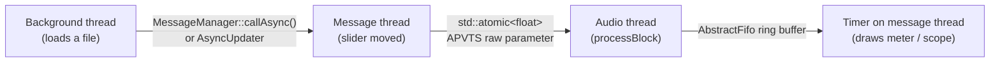
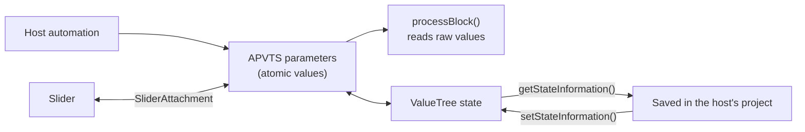

# Core concepts

**Five ideas carry most of JUCE: threads, components, state, listeners, and ownership.** Learn these and the rest of the API reads as variations on a theme.

## Threads {#threads}

A JUCE program usually has:

- **The message thread.** It exists once per process, runs the OS event loop via `MessageManager`, and is the only thread allowed to touch `Component`s.[^mm]
- **The audio thread.** It is owned by the audio driver or plug-in host and calls you every few milliseconds with a buffer. If it is late, the listener hears a click.
- **Any background threads you create** (`Thread`, `ThreadPool`, `TimeSliceThread`) for file loading, analysis, or network work.

### How long does the audio thread have?

The driver or host asks for one buffer at a time, and the next request arrives a fixed time later. That duration is the deadline for your whole `processBlock()`, including everything else in the signal chain.

<LatencyChart />

### Real-time rules for the audio thread

Inside `processBlock()` or `getNextAudioBlock()`, avoid anything whose running time is unbounded:

| Avoid | Why | Instead |
| --- | --- | --- |
| `new`, `malloc`, growing a `std::vector` or `juce::Array` | The allocator may take a lock or ask the OS | Allocate in `prepareToPlay()` |
| `CriticalSection` / `std::mutex` shared with the GUI | The GUI may hold it while it redraws | `std::atomic`, `AbstractFifo`, or `SpinLock` with care |
| File, network, or console I/O | Can block for milliseconds or seconds | Background thread plus a FIFO |
| Calling `Component` methods | Not thread-safe; asserts in debug | Post to the message thread |

### Moving data between threads



- **Single values** (gain, cutoff): `std::atomic<float>`. `AudioProcessorValueTreeState::getRawParameterValue()` returns exactly this.[^apvts]
- **Streams of samples or events**: `AbstractFifo` manages the read and write indices of a lock-free single-reader, single-writer FIFO.[^fifo]
- **"Do this on the message thread soon"**: `MessageManager::callAsync()`, `AsyncUpdater::triggerAsyncUpdate()`, or `ChangeBroadcaster::sendChangeMessage()`. Avoid calling these from the audio thread in tight loops, as they may allocate (this is general practice, not a JUCE-documented rule).
- **Polling**: a `Timer` (message thread, typically 30–60 Hz) reading atomics or a FIFO is the simplest way to drive meters and visualisers.
- **Smoothing**: `SmoothedValue` ramps parameter changes over a few milliseconds to avoid zipper noise.[^sv]

<SmoothingChart />

## Components {#components}

A JUCE GUI is a **tree of `Component` objects**. Each one is a rectangle that can draw itself, contain children, and respond to input.

```cpp
class MainComponent : public juce::Component
{
public:
    MainComponent()
    {
        addAndMakeVisible (button);       // add a child and show it
        button.onClick = [this] { ++clicks; repaint(); };
        setSize (400, 300);
    }

    void paint (juce::Graphics& g) override   // draw yourself
    {
        g.fillAll (juce::Colours::black);
        g.setColour (juce::Colours::white);
        g.drawText ("Clicks: " + juce::String (clicks), getLocalBounds(), juce::Justification::centred);
    }

    void resized() override                    // lay out your children
    {
        button.setBounds (getLocalBounds().removeFromBottom (40).reduced (8));
    }

private:
    juce::TextButton button { "Click me" };
    int clicks = 0;

    JUCE_DECLARE_NON_COPYABLE_WITH_LEAK_DETECTOR (MainComponent)
};
```

Key points:

- **`paint()` draws, `resized()` lays out.** Never lay out in `paint()`. Call `repaint()` to request a redraw; it is coalesced and happens later.
- **Children are usually members**, so their lifetime is tied to the parent's. The parent does not own children added with `addAndMakeVisible()`.
- **Layout helpers**: `Rectangle::removeFromTop()` and friends for simple slicing, and `FlexBox` and `Grid` for CSS-style layouts.[^grid]
- **Look and feel**: built-in widgets (`Slider`, `TextButton`, `ComboBox`…) delegate their drawing to a `LookAndFeel` object. Subclass `LookAndFeel_V4` to restyle a whole app without subclassing every widget.[^laf]
- **Windows**: a top-level component lives in a `DocumentWindow` or `ResizableWindow`, which creates the native `ComponentPeer`.
- **Alternatives**: since JUCE 8, a `WebBrowserComponent` can host an HTML/JS UI, with relay classes such as `WebSliderRelay` binding it to parameters.[^web] `juce_opengl` lets you render a component with OpenGL.

## State {#state}

JUCE favours **one tree of data as the source of truth**, observed by everything else.

- **`ValueTree`**: a lightweight, reference-counted tree of nodes. Each node has a type, named properties (`var`s), and children. It is cheap to copy (copies share data), can be serialised to XML or binary, and notifies `ValueTree::Listener`s of every change.[^vt]
- **`UndoManager`**: pass one to any `ValueTree` setter and the change becomes undoable.
- **`Value`**: a single observable value, often bound to a widget.
- **`AudioProcessorValueTreeState` (APVTS)**: the standard way to manage plug-in parameters. It owns the parameters, mirrors them into a `ValueTree` for saving, and offers *attachments* (`SliderAttachment`, `ButtonAttachment`, `ComboBoxAttachment`) that sync widgets and parameters in both directions, handling threading and host automation for you.
- **`var`, `DynamicObject`, `JSON`, `XmlElement`**: dynamic data for config files and interchange.
- **`PropertiesFile` / `ApplicationProperties`**: per-user settings files.



## Listeners and broadcasters {#listeners}

JUCE uses the observer pattern everywhere, with a consistent naming scheme:

| Source | Listener interface | Callback |
| --- | --- | --- |
| `Button` | `Button::Listener` (or the `onClick` lambda) | `buttonClicked()` |
| `Slider` | `Slider::Listener` (or `onValueChange`) | `sliderValueChanged()` |
| `ValueTree` | `ValueTree::Listener` | `valueTreePropertyChanged()` … |
| `ChangeBroadcaster` | `ChangeListener` | `changeListenerCallback()` |
| `AudioProcessor` | `AudioProcessorListener` | `audioProcessorParameterChanged()` … |
| `Timer` | *(you subclass it)* | `timerCallback()` |

`ListenerList` is the underlying container. It is safe against listeners removing themselves during a callback. Always remove a listener in your destructor if the broadcaster may outlive you.

## Ownership and memory {#ownership}

JUCE predates widespread C++11, so it has its own smart types. Modern JUCE interoperates with the standard library freely.

- **Owning containers**: `OwnedArray<T>` deletes its elements; `std::vector<std::unique_ptr<T>>` is equivalent.
- **Shared ownership**: `ReferenceCountedObject` with `ReferenceCountedObject::Ptr`. This is intrusive, so it is cheap and safe to pass as a raw pointer. `ValueTree` and `Image` share reference-counted data internally.[^vt]
- **Weak references**: `WeakReference<T>`, and `Component::SafePointer<T>`, which becomes null when the component is deleted. Use it in async callbacks.
- **Leak detection**: `JUCE_DECLARE_NON_COPYABLE_WITH_LEAK_DETECTOR (ClassName)` at the end of a class makes it non-copyable, and in debug builds reports any instances still alive at shutdown.
- **`jassert`**: debug-only assertion that breaks into the debugger. JUCE uses thousands of them to flag misuse. When one fires, read the comment next to it.

## Strings and text {#strings}

`juce::String` is a reference-counted string held as UTF-8[^str] with a rich API (`upToFirstOccurrenceOf`, `fromFirstOccurrenceOf`, `formatted`…). `StringArray`, `Identifier` (interned strings used as fast property keys in `ValueTree`), and `StringRef` round out the set. Convert to and from `std::string` with `toStdString()` and the `String(std::string)` constructor.

## Sources

[^mm]: [`juce_MessageManager.h`](https://github.com/juce-framework/JUCE/blob/master/modules/juce_events/messages/juce_MessageManager.h) (`callAsync`, message thread) and [`juce_Component.h`](https://github.com/juce-framework/JUCE/blob/master/modules/juce_gui_basics/components/juce_Component.h). The "only thread allowed to touch Components" rule is the usual JUCE convention; the exact wording is in those headers' comments.
[^apvts]: [`juce_AudioProcessorValueTreeState.h`](https://github.com/juce-framework/JUCE/blob/master/modules/juce_audio_processors/utilities/juce_AudioProcessorValueTreeState.h): `std::atomic<float>* getRawParameterValue (StringRef parameterID) const noexcept`.
[^fifo]: [`juce_AbstractFifo.h`](https://github.com/juce-framework/JUCE/blob/master/modules/juce_core/containers/juce_AbstractFifo.h): "lock-free FIFO", "single-reader, single-writer FIFO", "It doesn't actually hold any data itself".
[^sv]: [`juce_SmoothedValue.h`](https://github.com/juce-framework/JUCE/blob/master/modules/juce_audio_basics/utilities/juce_SmoothedValue.h). "Zipper noise" is standard audio terminology.
[^laf]: [`juce_LookAndFeel_V4.h`](https://github.com/juce-framework/JUCE/blob/master/modules/juce_gui_basics/lookandfeel/juce_LookAndFeel_V4.h).
[^grid]: [`juce_Grid.h`](https://github.com/juce-framework/JUCE/blob/master/modules/juce_gui_basics/layout/juce_Grid.h) and `juce_FlexBox.h` in the same folder.
[^web]: [`juce_WebControlRelays.h`](https://github.com/juce-framework/JUCE/blob/master/modules/juce_gui_extra/misc/juce_WebControlRelays.h) (`WebSliderRelay`); [`CHANGE_LIST.md`](https://github.com/juce-framework/JUCE/blob/master/CHANGE_LIST.md), Version 8.0.0: "Added support for WebView based UIs".
[^vt]: [`juce_ValueTree.h`](https://github.com/juce-framework/JUCE/blob/master/modules/juce_data_structures/values/juce_ValueTree.h): "a lightweight reference to a shared data container", optional `UndoManager` on setters.
[^str]: [`juce_String.h`](https://github.com/juce-framework/JUCE/blob/master/modules/juce_core/text/juce_String.h): "Using a reference-counted internal representation".
