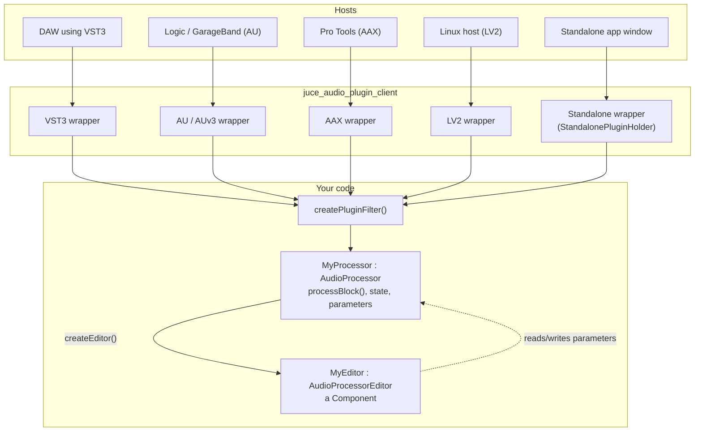
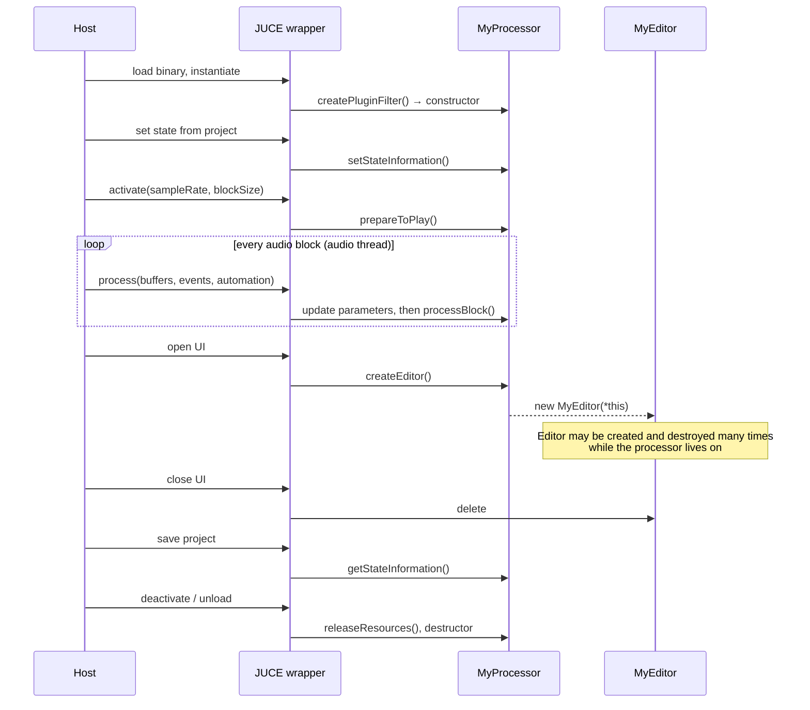

# Anatomy of a plug-in

**You write one `AudioProcessor` (the sound) and optionally one `AudioProcessorEditor` (the window). JUCE compiles a thin wrapper around them for each plug-in format, and the wrapper translates the host's calls into yours.**

## The moving parts

The build produces one shared-code static library containing your processor and editor. It then links that library into one small target per format (see [Build systems](./build-systems)). This is why a JUCE plug-in project has targets like `MyPlugin_VST3`, `MyPlugin_AU`, and `MyPlugin_Standalone`.

## The `AudioProcessor` contract

| Method | Thread | Called when | Your job |
| --- | --- | --- | --- |
| constructor | message | the host instantiates the plug-in | declare buses (`BusesProperties`) and parameters |
| `prepareToPlay (sampleRate, maxBlockSize)` | message* | before playback, or when the rate or block size changes | allocate buffers, reset filters |
| `processBlock (AudioBuffer&, MidiBuffer&)` | **audio** | every block | read input, write output, consume and produce MIDI |
| `releaseResources()` | message* | playback stops | free what `prepareToPlay` allocated |
| `isBusesLayoutSupported()` | message* | the host proposes a channel layout | accept or reject mono, stereo, surround… |
| `getStateInformation (MemoryBlock&)` | message* | the host saves a project or preset | serialise your state (usually the APVTS `ValueTree`) |
| `setStateInformation (data, size)` | message* | the host loads a project or preset | restore it |
| `createEditor()` / `hasEditor()` | message | the user opens the plug-in window | return a new editor |
| `getName()`, `acceptsMidi()`, `getTailLengthSeconds()` … | any | the host asks | describe the plug-in |

\* *Usually* the message thread, but hosts vary. Treat these as "not the audio thread, but not guaranteed to be the GUI thread either".

## A plug-in's life, from the host's point of view

**The editor is disposable.** Hosts open and close the window at will, and some never open it. All state must live in the processor; the editor only displays and edits it.

## Parameters

Parameters are how the host sees your plug-in's controls: for automation lanes, generic UIs, and control surfaces.

- Each is a subclass of `AudioProcessorParameter`: usually `AudioParameterFloat`, `AudioParameterInt`, `AudioParameterBool`, or `AudioParameterChoice` (all `RangedAudioParameter`s).
- Most plug-ins create them through **`AudioProcessorValueTreeState`**, then bind editor widgets with attachments.
- The audio thread reads the current value via `getRawParameterValue()` (an `std::atomic<float>*`) or directly from the parameter object.
- Parameter IDs are part of your saved-state format and automation data. **Never rename them after release.** A `ParameterID` also carries a `versionHint`, which keeps Audio Unit parameter ordering backwards-compatible in Logic and GarageBand when you add parameters in a later release.

## Buses and channels

A *bus* is a group of channels, such as a stereo main input, a mono side-chain, or a 5.1 output. You declare buses in the constructor with `BusesProperties`. The host negotiates the actual layout via `isBusesLayoutSupported()`. In `processBlock()`, the single `AudioBuffer` holds every channel of every bus; use `getBusBuffer()` to get the slice for one bus.

## Formats at a glance

| Format | Owner | Platforms | Notes |
| --- | --- | --- | --- |
| **VST3** | Steinberg | macOS, Windows, Linux | SDK bundled with JUCE |
| **AU** (Audio Unit v2) | Apple | macOS | Needed for Logic Pro and GarageBand |
| **AUv3** | Apple | macOS, iOS | App extension, sandboxed; the only plug-in format on iOS |
| **AAX** | Avid | macOS, Windows | Pro Tools only; release builds need PACE signing (see the README) |
| **LV2** | Open standard | mainly Linux | Authoring and hosting added in JUCE 7 |
| **Standalone** | JUCE | desktop | Your plug-in in its own app window with an audio settings dialog |
| **Unity** | Unity | desktop | Native audio plug-in for the Unity game engine |
| **VST** (VST2) | Steinberg | — | Legacy. Steinberg no longer licenses the SDK to new developers. |

## Hosting other plug-ins

The same abstractions work in reverse. `AudioPluginFormatManager` knows the formats. `KnownPluginList` and `PluginListComponent` scan for and list installed plug-ins, and `createPluginInstance()` gives you an `AudioPluginInstance` (an `AudioProcessor`). You can then put it in an `AudioProcessorGraph`. `extras/AudioPluginHost` is a complete working example.

## Try it

1. Build `examples/CMake/AudioPlugin` (see [Learning path](./learning-path)).
2. Open the Standalone target, then load the VST3 into `AudioPluginHost`.
3. Put a breakpoint in `prepareToPlay()` and `processBlock()` and watch the order of calls.
