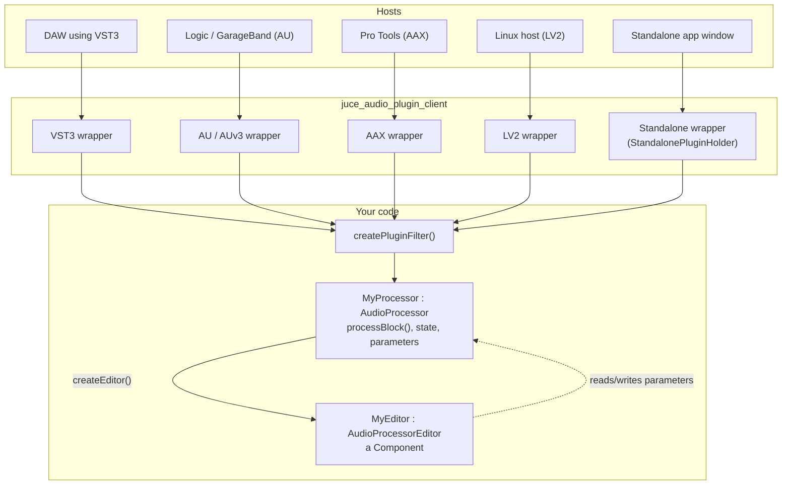
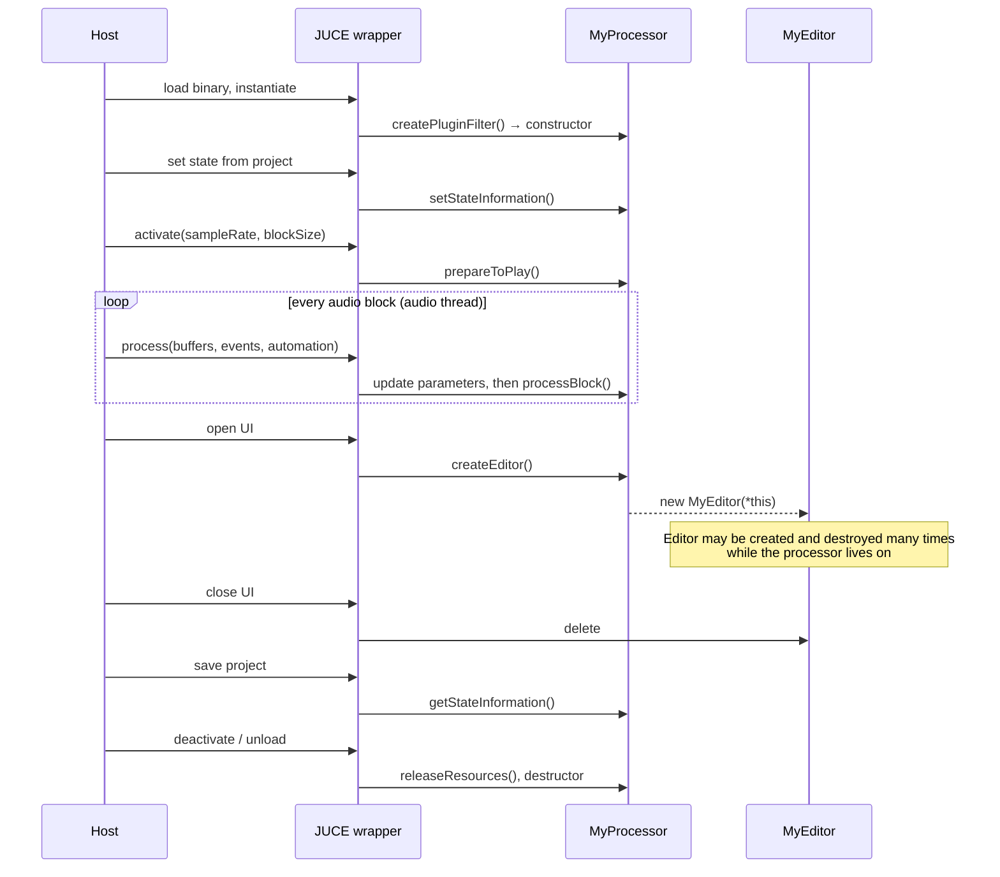

# Anatomy of a plug-in

**You write one `AudioProcessor` (the sound) and optionally one `AudioProcessorEditor` (the window). JUCE compiles a thin wrapper around them for each plug-in format, and the wrapper translates the host's calls into yours.**

## The moving parts

The build produces one shared-code static library containing your processor and editor. It then links that library into one small target per format (see [Build systems](./build-systems)).[^cmake] This is why a JUCE plug-in project has targets like `MyPlugin_VST3`, `MyPlugin_AU`, and `MyPlugin_Standalone`.

## The `AudioProcessor` contract

The method names and their purposes come from `AudioProcessor`.[^ap] The "Thread" column is this site's summary of common host behaviour; JUCE does not guarantee it, hence the footnote below the table.

| Method | Thread | Called when | Your job |
| --- | --- | --- | --- |
| constructor | message | the host instantiates the plug-in | declare buses (`BusesProperties`) and parameters |
| `prepareToPlay (sampleRate, maxBlockSize)` | message* | before playback, or when the rate or block size changes | allocate buffers, reset filters |
| `processBlock (AudioBuffer&, MidiBuffer&)` | **audio** | every block | read input, write output, consume and produce MIDI |
| `releaseResources()` | message* | playback stops | free what `prepareToPlay` allocated |
| `isBusesLayoutSupported()` | message* | the host proposes a channel layout | accept or reject mono, stereo, surround… |
| `getStateInformation (MemoryBlock&)` | message* | the host saves a project or preset | serialise your state (usually the APVTS `ValueTree`) |
| `setStateInformation (data, size)` | message* | the host loads a project or preset | restore it |
| `createEditor()` / `hasEditor()` | message | the user opens the plug-in window | return a new editor |
| `getName()`, `acceptsMidi()`, `getTailLengthSeconds()` … | any | the host asks | describe the plug-in |

\* *Usually* the message thread, but hosts vary. Treat these as "not the audio thread, but not guaranteed to be the GUI thread either". This is a cautious reading, not a documented guarantee.

## A plug-in's life, from the host's point of view

**The editor is disposable.** Hosts open and close the window at will, and some never open it. All state must live in the processor; the editor only displays and edits it.

## Parameters

Parameters are how the host sees your plug-in's controls: for automation lanes, generic UIs, and control surfaces.

- Each is a subclass of `AudioProcessorParameter`: usually `AudioParameterFloat`, `AudioParameterInt`, `AudioParameterBool`, or `AudioParameterChoice` (all `RangedAudioParameter`s).
- Most plug-ins create them through **`AudioProcessorValueTreeState`**, then bind editor widgets with attachments.
- The audio thread reads the current value via `getRawParameterValue()` (an `std::atomic<float>*`)[^apvts] or directly from the parameter object.
- Parameter IDs are part of your saved-state format and automation data. **Never rename them after release.** A `ParameterID` also carries a `versionHint`, which keeps Audio Unit parameter ordering backwards-compatible in Logic and GarageBand when you add parameters in a later release.[^pid]

## Buses and channels

A *bus* is a group of channels, such as a stereo main input, a mono side-chain, or a 5.1 output. You declare buses in the constructor with `BusesProperties`. The host negotiates the actual layout via `isBusesLayoutSupported()`. In `processBlock()`, the single `AudioBuffer` holds every channel of every bus; use `getBusBuffer()` to get the slice for one bus.

## Formats at a glance

| Format | Owner | Platforms | Notes |
| --- | --- | --- | --- |
| **VST3** | Steinberg | macOS, Windows, Linux[^vst3] | SDK bundled with JUCE[^sdk] |
| **AU** (Audio Unit v2) | Apple | macOS[^cmake] | JUCE's docs mention Logic and GarageBand AU compatibility[^pid] |
| **AUv3** | Apple | macOS, iOS | App extension. Built only with the Xcode generator[^cmake] |
| **AAX** | Avid | macOS, Windows | Pro Tools; commercially available Pro Tools needs PACE-signed plug-ins[^aax] |
| **LV2** | Open standard | not checked | Authoring and hosting added in JUCE 7[^cl7] |
| **Standalone** | JUCE | desktop | Your plug-in in its own app window (`StandalonePluginHolder`)[^sa] |
| **Unity** | Unity | not checked | Native audio plug-in for the Unity game engine[^wt] |
| **VST** (VST2) | Steinberg | — | Legacy. Steinberg discontinued VST 2[^vst2]; JUCE needs you to supply the SDK path |

Platforms marked "not checked", and the owner column generally, come from common knowledge of each format rather than a source in this repository.

## Hosting other plug-ins

The same abstractions work in reverse. `AudioPluginFormatManager` knows the formats. `KnownPluginList` and `PluginListComponent` scan for and list installed plug-ins, and `createPluginInstance()` gives you an `AudioPluginInstance` (an `AudioProcessor`). You can then put it in an `AudioProcessorGraph`. `extras/AudioPluginHost` is a complete working example.[^host] For the other direction, a real `AudioPluginInstance` that wraps a foreign DSP engine, read [Cmajor and the JUCE bridge](./cmajor-bridge).

## Try it

1. Build `examples/CMake/AudioPlugin` (see [Learning path](./learning-path)).
2. Open the Standalone target, then load the VST3 into `AudioPluginHost`.
3. Put a breakpoint in `prepareToPlay()` and `processBlock()` and watch the order of calls.

## Sources

[^cmake]: [`docs/CMake API.md`](https://github.com/juce-framework/JUCE/blob/master/docs/CMake%20API.md), `FORMATS`: valid values `Standalone Unity VST3 AU AUv3 AAX VST LV2`; "`AU` and `AUv3` plugins will only be enabled when building on macOS; `AUv3` plugins will only be enabled when using the Xcode generator"; one target per format, for example `MyPlugin_VST3`.
[^ap]: [`juce_AudioProcessor.h`](https://github.com/juce-framework/JUCE/blob/master/modules/juce_audio_processors_headless/processors/juce_AudioProcessor.h): `prepareToPlay`, `processBlock`, `releaseResources`, `createEditor`, `getTailLengthSeconds`, `getBusBuffer`, and the `wrapperType_*` enum (VST, VST3, AudioUnit, AudioUnitv3, AAX, Standalone, Unity, LV2).
[^pid]: [`juce_AudioProcessorParameterWithID.h`](https://github.com/juce-framework/JUCE/blob/master/modules/juce_audio_processors_headless/utilities/juce_AudioProcessorParameterWithID.h): `versionHint` "Influences parameter ordering in Audio Unit plugins. Used to provide backwards compatibility of Audio Unit plugins in Logic and GarageBand."
[^apvts]: [`juce_AudioProcessorValueTreeState.h`](https://github.com/juce-framework/JUCE/blob/master/modules/juce_audio_processors/utilities/juce_AudioProcessorValueTreeState.h).
[^vst3]: [`CHANGE_LIST.md`](https://github.com/juce-framework/JUCE/blob/master/CHANGE_LIST.md), Version 6.0.0: "Added VST3 support on Linux"; [`README.md`](https://github.com/juce-framework/JUCE/blob/master/README.md) deployment targets list macOS, Windows, and Linux.
[^sdk]: `CHANGE_LIST.md`, Version 8.0.11: "Updated the VST3 SDK to 3.8.0 (MIT license)"; JUCE 8.0.0: "Bundled the AAX SDK". See also the [SPDX bill of materials](https://github.com/juce-framework/JUCE/blob/master/JUCE.spdx.json).
[^aax]: [`README.md`, "AAX Plug-Ins"](https://github.com/juce-framework/JUCE/blob/master/README.md#aax-plug-ins): AAX plug-ins must be signed with PACE tools "before they will run in commercially available versions of Pro Tools". Avid as the owner of AAX is named in the same section.
[^cl7]: `CHANGE_LIST.md`, Version 7.0.0: "Added support for authoring and hosting LV2 plug-ins".
[^sa]: [`juce_StandaloneFilterWindow.h`](https://github.com/juce-framework/JUCE/blob/master/modules/juce_audio_plugin_client/Standalone/juce_StandaloneFilterWindow.h).
[^wt]: `CHANGE_LIST.md` mentions "Unity native plug-in support" (Version 5.4.0); the Unity wrapper type is in `juce_AudioProcessor.h`. That Unity is a game engine is general knowledge.
[^vst2]: [VST 2 Discontinued, Steinberg Help Center](https://helpcenter.steinberg.de/hc/en-us/articles/4409561018258-VST-2-Discontinued); [Steinberg closing down VST2 for good, JUCE Forum](https://forum.juce.com/t/steinberg-closing-down-vst2-for-good/27722); the `juce_set_vst2_sdk_path` requirement is in [`docs/CMake API.md`](https://github.com/juce-framework/JUCE/blob/master/docs/CMake%20API.md). Retrieved 2026-09-29 from search-result summaries; the Steinberg page itself was not opened.
[^host]: [`extras/AudioPluginHost`](https://github.com/juce-framework/JUCE/blob/master/extras/AudioPluginHost); the scanning and format classes are in [`juce_KnownPluginList.h`](https://github.com/juce-framework/JUCE/blob/master/modules/juce_audio_processors/scanning/juce_KnownPluginList.h) and [`juce_PluginListComponent.h`](https://github.com/juce-framework/JUCE/blob/master/modules/juce_audio_processors/scanning/juce_PluginListComponent.h).
